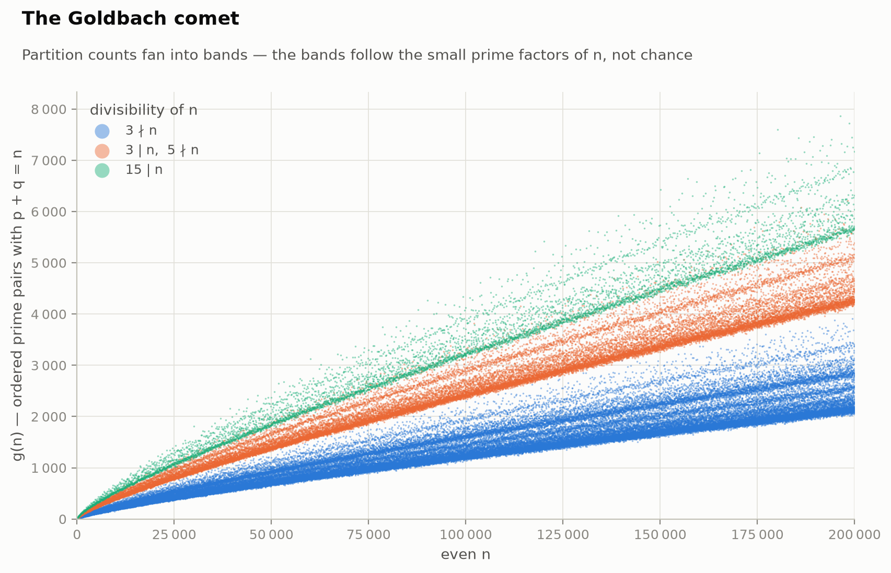
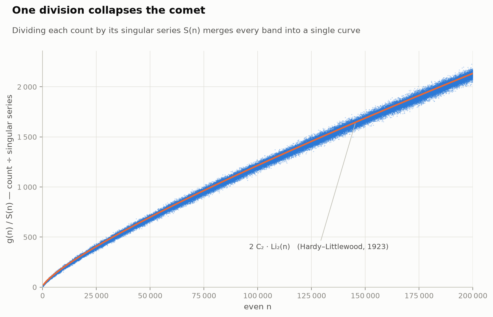
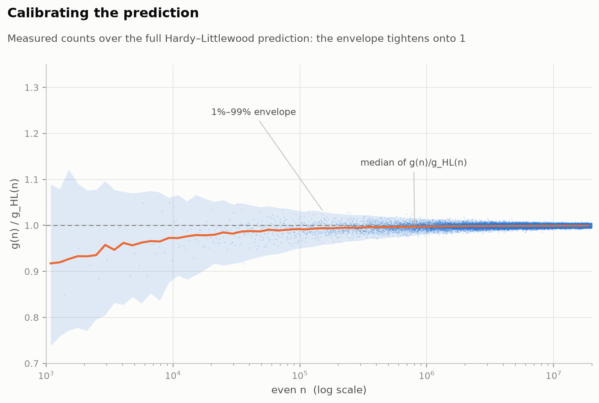
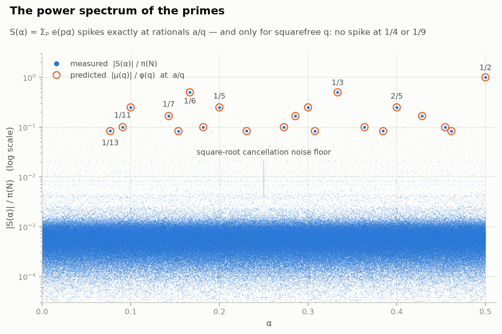
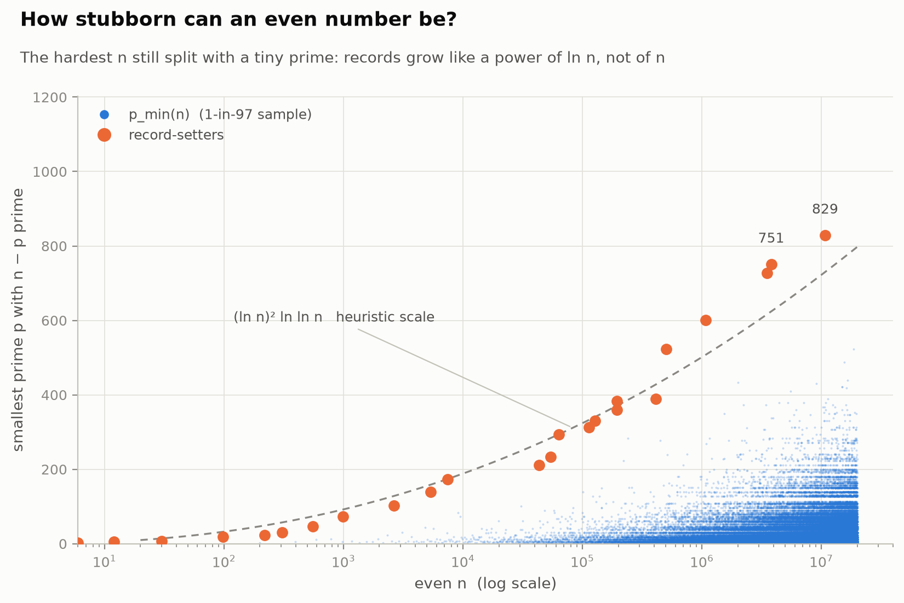
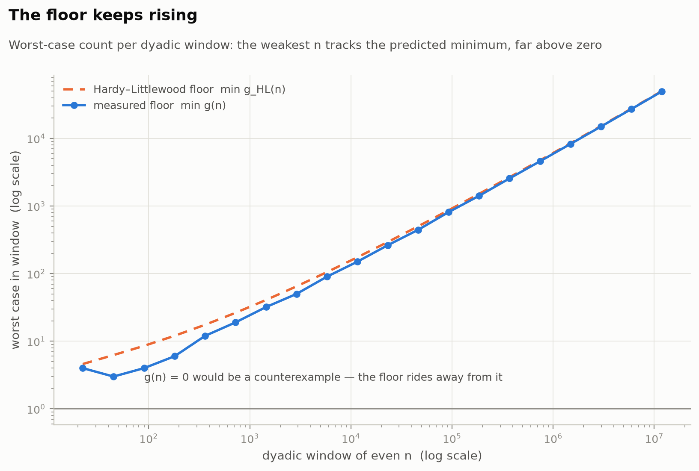
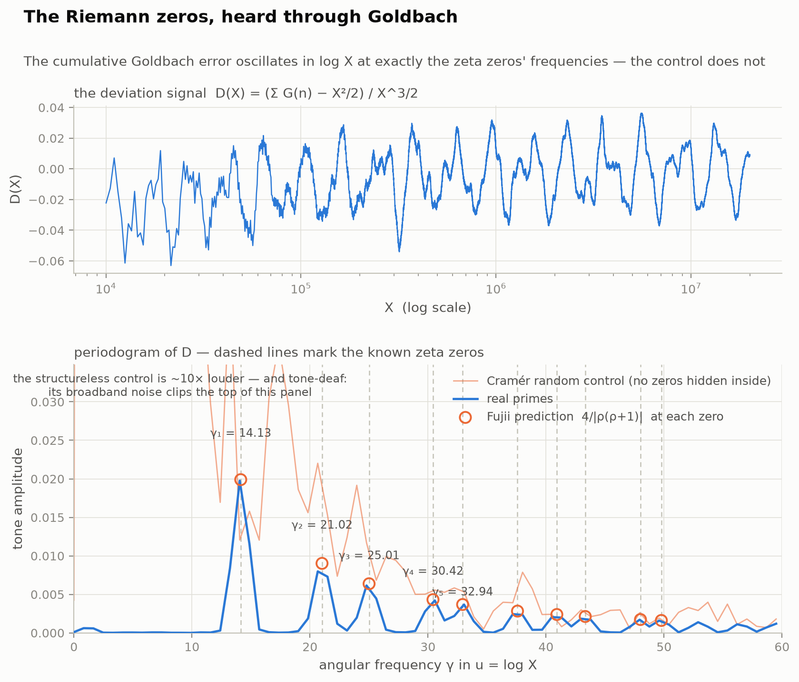

# Goldbach: instruments, not incantations

> **This repository does not prove the Goldbach conjecture. Nobody has.**
> What it does instead is honest: it builds fast instruments for *measuring* the
> conjecture's structure, runs experiments with them, and separates every claim
> into **theorem**, **heuristic**, or **measurement**. The mathematics of why a
> proof remains out of reach — and what any proof would have to overcome — is in
> [THEORY.md](THEORY.md).

The conjecture: **every even number greater than 2 is a sum of two primes.**
Stated by Goldbach and Euler in 1742, verified by computer up to 4·10¹⁸, proved
for no infinite range of even numbers at all.

## The instrument

The count of ordered prime pairs with p + q = n is the **autocorrelation of the
prime indicator**, so one FFT computes g(n) for *every* n at once:

```
a = [1 if k is an odd prime else 0]          # one array
g = round(irfft(rfft(a)²))                   # every Goldbach count to N, exactly
```

That's `goldbach/counts.py` — all 10 million counts up to N = 20,000,000 in a
few seconds, exact (the worst floating-point residual is 1.7·10⁻¹⁰ against an
exactness threshold of 0.5, and the counts are unit-tested against brute force).
It is also the [circle method](THEORY.md#the-circle-method-connection) made
executable: the FFT of the prime indicator *is* the exponential sum S(α), and
g(n) is the inverse transform of the power spectrum |S(α)|². The same identity
that Hardy and Littlewood attacked with pen and paper in 1923 is here a
measuring device.

## The experiments

### 1. The comet has bands — and the bands are arithmetic



Plot g(n) for every even n and the points fan into separated bands. Color by
the small prime factors of n and the mystery dissolves: n divisible by 3 has
roughly twice the partitions of n that isn't, because n − p then avoids one
residue class of collisions. The comet's "chaos" is congruence structure.

### 2. One division collapses the comet



Hardy and Littlewood packaged that structure into a single multiplicative
factor, the singular series S(n) = ∏ (p−1)/(p−2) over odd primes p | n.
Divide each count by its S(n) and **every band collapses onto one curve** —
the smooth curve 2·C₂·Li₂(n) predicted in 1923. Nothing about the comet's
shape is unexplained: arithmetic accounts for the bands, and a single smooth
density accounts for the rest.

### 3. The prediction calibrates to 1% — and keeps improving



The ratio of measured count to full prediction, for every even n up to 2·10⁷:
the median at the top of the range is **0.9992**, and 98% of all even n land
within **[0.990, 1.007]** of the prediction. The envelope visibly tightens as n
grows — consistent with square-root-size fluctuations around the model, which
is exactly what the model itself expects.

### 4. The power spectrum of the primes — the circle method, photographed



|S(α)| computed exactly on a 720,720-point grid (chosen so every rational a/q
with q ≤ 16 lies exactly on the grid). The predicted spike heights |μ(q)|/φ(q)
are drawn as rings; the measurements sit inside them to four decimal places
(measured height at α = 1/2: 0.9999984; at 1/3: 0.4999989). Note the spikes
exist **only at squarefree denominators** — there is no spike at 1/4 or 1/9,
exactly as the Möbius factor demands — and everything off the spikes lives in
a square-root-cancellation noise floor. Those spikes are what *proves* the
main term; the noise floor is what nobody can control tightly enough for the
binary problem. The whole difficulty of Goldbach is visible in this one image.

### 5. The stubbornness of even numbers is polylogarithmic



p_min(n) = the smallest prime that Goldbach-splits n. Up to 2·10⁷ the
all-time record is **p_min = 829**, at n = 10,759,922 — an eight-digit number
that still splits using a three-digit prime. Record growth tracks
(ln n)²·ln ln n, matching the heuristic that failures of small primes behave
like independent rare events. (The record list reproduces OEIS A025018/A025019.)

### 6. The floor keeps rising



Per dyadic window, the *worst* even number's count, against the model's
predicted minimum. In the top window the weakest n still has **49,382**
representations against a predicted floor of ≈49,978 (within 1.2%). A
counterexample would need g(n) = 0; the measured floor rides the prediction
away from zero like n/ln²n. This is evidence about *why the conjecture is
believed* — and simultaneously a demonstration of why computation alone can
never finish the job: no finite floor stops a single distant exception.

### 7. The Riemann zeros, heard through Goldbach



The deepest experiment (`experiments/riemann_zeros.py`): weight the primes
the way the zeta function does (von Mangoldt), cumulate the Goldbach counts,
subtract the main term X²/2, rescale by X^(3/2) — and the residue is not
noise. Its periodogram in log X shows sharp tones at **14.13, 21.02, 25.01,
30.42, 32.94, …** — the imaginary parts of the Riemann zeta zeros — with
amplitudes matching Fujii's RH-conditional explicit formula to ~1% at the
first and fifth zeros. A Cramér random "fake prime" control of identical
density is ~10× *louder* and tone-deaf: no alignment with any zero, p = 0
under a template-shift test. The primes are quieter than chance, and what
remains of their sound is precisely the zeros of ζ. Details and honest
novelty assessment in [RESEARCH_LOG.md](RESEARCH_LOG.md).

## Headline numbers (N = 20,000,000, full run ≈ 23 s)

| Quantity | Value |
|---|---|
| Even n verified to have a partition | all 4 ≤ n ≤ 2·10⁷ |
| Fewest partitions of any even n ≥ 10⁶ (unordered) | 3,963 |
| Median of measured/predicted at n ≥ 10⁶ | 0.99924 |
| 1%–99% envelope at n ≥ 10⁶ | [0.9900, 1.0072] |
| Record minimal splitting prime | 829 (at n = 10,759,922) |
| FFT exactness residual | 1.7·10⁻¹⁰ (threshold 0.5) |

## Run it

```bash
pip install numpy matplotlib
python tests/test_goldbach.py        # every instrument vs brute force
python experiments/run_all.py        # full suite at N = 20,000,000
python experiments/run_all.py 500000 # or any N you like
```

## Layout

```
goldbach/            the instruments
  counts.py          all Goldbach counts at once, by FFT autocorrelation
  hardy_littlewood.py the 1923 model: C₂, singular series, Li₂
  spectrum.py        S(α) exactly on a divisor-rich grid
  minimal_prime.py   p_min(n) and its records
  sieve.py           Eratosthenes
experiments/run_all.py   reproduces every figure and results/summary.json
tests/               brute-force ground truth for each instrument
figures/  results/   outputs of the full run
THEORY.md            what is proven, what is predicted, and why the proof is hard
```

## The honest summary

Everything measured here behaves exactly as the Hardy–Littlewood model
predicts, to within fluctuations the model itself anticipates. That is strong
evidence the conjecture is *true*, and zero progress toward *proving* it —
those are different things, and the gap between them (the minor arcs, the
parity barrier) is precisely mapped in [THEORY.md](THEORY.md).
