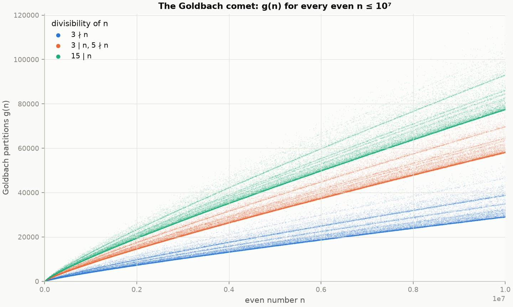
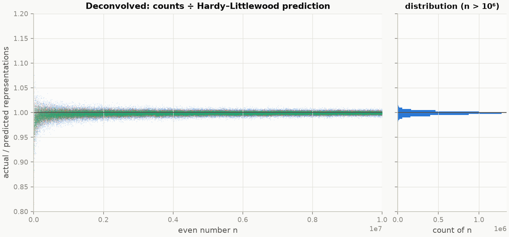
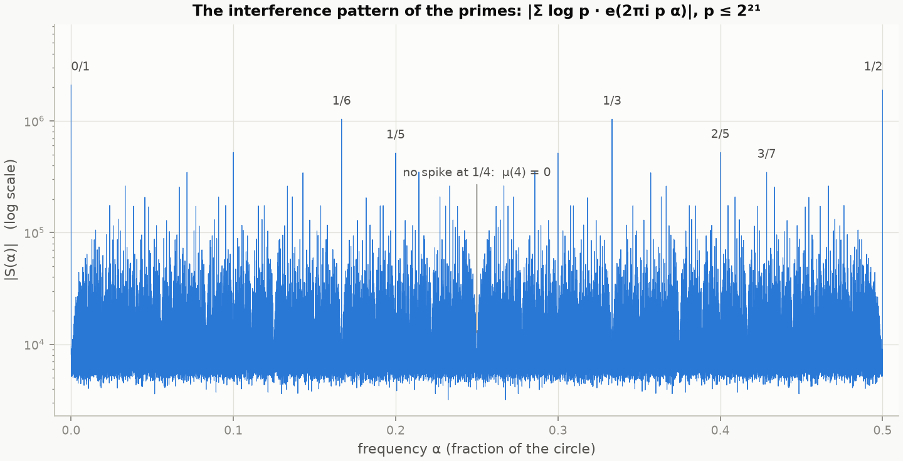
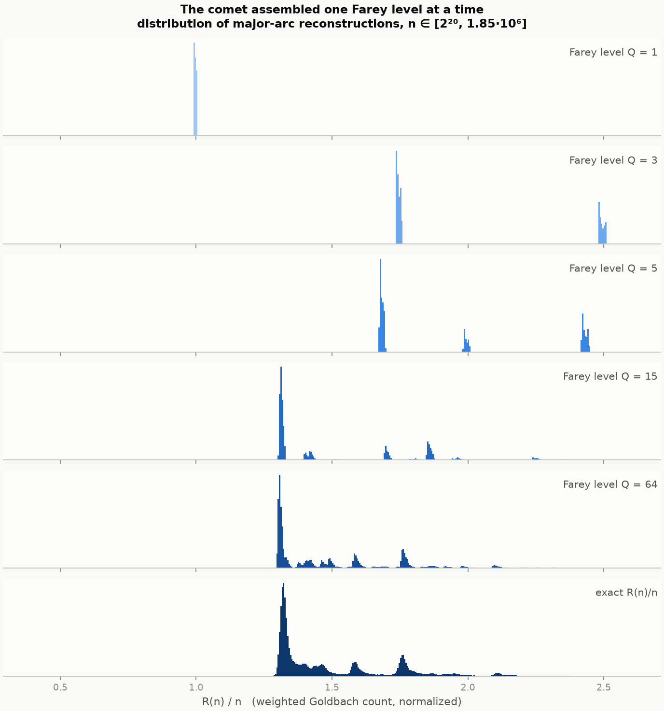
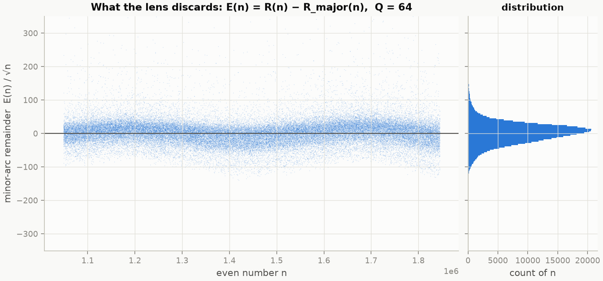
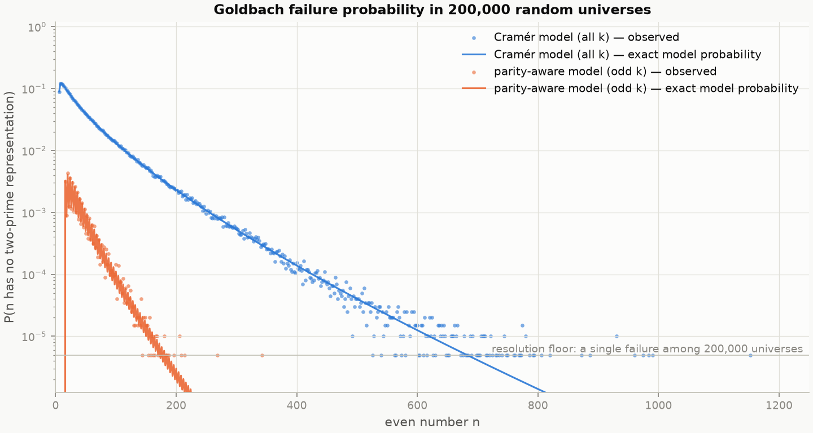
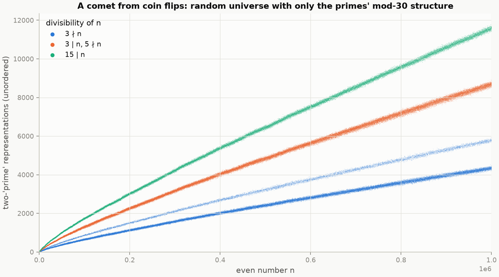
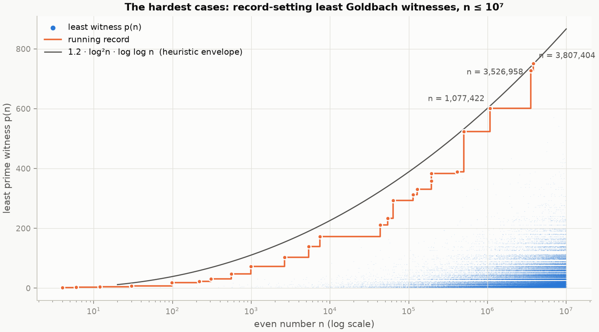

# The Goldbach Lab Report

*An experimental anatomy of the Goldbach conjecture — what we built, what we
measured, and exactly why none of it (nor anything anyone has yet built)
constitutes a proof.*

---

## 0. The ground rules

The Goldbach conjecture — **every even number greater than 2 is a sum of two
primes** — has been open since 1742. This repository does not close it, and
no document that claimed to in a weekend would deserve your trust. What a
computational lab *can* do is unusual and, we think, beautiful: build
instruments that make the conjecture's hidden structure visible, measure the
exact quantity that a proof would have to control, and quantify how far the
measured truth sits from the provable bounds. Everything below is verified
against independent ground truth (OEIS sequences, brute-force recounts, and
closed-form checks); the test suite in `tests/` reproduces every claim.

Notation: for even `n`, `g(n)` is the number of unordered prime pairs
`{p, q}` with `p + q = n`; `R(n) = Σ_{p+q=n} log p · log q` is the standard
log-weighted count the analytic theory prefers.

---

## 1. One FFT counts them all

The number of representations of every even number at once is the
self-convolution of the prime indicator — so a single FFT of size 2²⁵
computes `g(n)` **exactly** for all even `n ≤ 10⁷` (float64 round-off here is
~10⁻⁹, nine orders of magnitude below the nearest integer; results confirmed
against OEIS A045917 and brute force). Plotted, this is the **Goldbach
comet**, colored by the divisibility of `n`:

The result of the count: **the minimum of `g(n)` over each decade rises
steadily; no even number up to 10⁷ has fewer than 1 partition, and beyond
n = 10⁶ none has fewer than 3,963.** The conjecture is not merely surviving
— its margin is widening.

| range of n | mean g/prediction | sd | min g(n) | at n |
|---|---|---|---|---|
| [10, 10²) | 0.7244 | 0.2115 | 1 | 12 |
| [10², 10³) | 0.8769 | 0.1082 | 3 | 128 |
| [10³, 10⁴) | 0.9584 | 0.0533 | 16 | 1,112 |
| [10⁴, 10⁵) | 0.9873 | 0.0238 | 92 | 10,006 |
| [10⁵, 10⁶) | 0.9962 | 0.0100 | 570 | 100,094 |
| [10⁶, 10⁷) | 0.9989 | 0.0040 | 3,963 | 1,002,002 |

## 2. The comet deconvolved: all the structure is local

Hardy and Littlewood (1923) predicted the ordered count as
`R₂(n) ≈ 2C₂ · Π_{p|n, p>2} (p−1)/(p−2) · J(n)`, where `C₂ = 0.66016…` is the
twin-prime constant and `J(n) = ∫₂^{n−2} dt / (log t · log(n−t))`. The jagged
product over primes dividing `n` is the **singular series** — pure local
arithmetic. Divide it out, and the comet's entire firework of bands collapses
into one featureless ribbon around 1:

By the last decade the prediction is accurate to **0.11% on average** (table
above). Every visible feature of Goldbach counts is explained by congruence
conditions; what remains is statistical noise. The conjecture is the
statement that this noise never — not once — reaches all the way to zero.

## 3. The Farey lens: the circle method as an instrument

The classical route to Goldbach (Hardy–Littlewood–Vinogradov) writes `R(n)`
as a Fourier integral of `S(α) = Σ_{p≤N} log p · e(2πi p α)`. We built that
object literally: the primes to `N = 2²¹`, log-weighted, transformed in one
FFT of size 2²³. This is what the primes look like as an interference
pattern:

Towering spikes at every rational `a/q` with small square-free denominator —
heights falling like `μ(q)/φ(q)` (note the *absence* of a spike at 1/4:
`μ(4) = 0`, exactly as the theory demands) — floating on an ocean of √N-sized
noise. The circle method's "major arcs" are the spikes; the "minor arcs" are
the ocean.

**The lens:** keep only the spectrum within 16 bins of every Farey fraction
of level `Q`, inverse-transform, and you reconstruct — for *every* `n`
simultaneously — the part of `R(n)` that arithmetic structure accounts for.
Watching the reconstruction as `Q` grows is watching the comet crystallize
one Farey level at a time:

| Farey level Q | correlation with exact R(n) |
|---|---|
| 1 | 0.000 |
| 3 | 0.911 |
| 5 | 0.966 |
| 15 | 0.991 |
| 64 | **0.99916** |

At `Q = 1` the lens sees only the smooth average (one lump, centered at
`R(n)/n ≈ 1`: the prime number theorem and nothing else). `Q = 3` splits the
world into `3|n` and `3∤n`. Each further level splits the bands again, until
`Q = 64` is visually indistinguishable from the truth.

**And here is the whole difficulty of the Goldbach conjecture in one
picture** — the part the lens *discards*:

The discarded minor-arc term `E(n) = R(n) − R_major(n)` measures, per `n`:

- typical size: `|E(n)| ≈ 38·√n` (RMS of `E/√n` = 38.2 ≈ 0.19·√n·log²n)
- mean `|E(n)|` / main term: **1.1%**
- worst case in the window: 10.4% of the main term, at `n = 1,711,710 =
  2·3²·5·7·11·13·19` — precisely the most composite, largest-main-term `n`,
  where the singular series converges slowest

The empirical truth is that `E(n)` behaves like square-root noise. **Nobody
can prove anything remotely that strong for any individual `n`** — see §6.

## 4. Random universes: Goldbach is forced by almost nothing

Take Cramér's model: declare each integer `k ≥ 3` "prime" independently with
probability `1/log k`. We sampled **200,000 such universes** (plus 200,000
parity-corrected ones: odd numbers only, probability `2/log k`) and recorded
every Goldbach failure:

The observed failure frequencies ride exactly on the closed-form curve
`P(fail at n) = Π_{k<n/2} (1 − π_k π_{n−k})` ≈ `exp(−J(n)/2)` for four
decades until they hit the 1-in-200,000 resolution floor. The largest `n`
that *ever* failed, in any universe: **1,152** (naive), **342**
(parity-aware). The expected number of failures at any even number beyond
`x`, summed over the infinite tail:

| beyond x | expected failures, ever |
|---|---|
| 10³ | 10^(−4.9) |
| 10⁴ | 10^(−31.3) |
| 10⁶ | 10^(−1,335) |
| 10⁹ | 10^(−561,336) |

That last entry is a probability whose decimal representation needs half a
million zeros. In a random universe, Borel–Cantelli makes Goldbach an almost
sure statement with insane room to spare.

And the model needs almost none of the primes' personality: a universe of
coin flips that keeps only the primes' **mod-30 structure** already grows the
real comet's bands, in the right order and proportions:

Everything visible about Goldbach counts is local arithmetic; the only thing
the real primes must supply is *enough global randomness*. That is precisely
what nobody can prove they supply (§6).

## 5. The hardest customers: witness records

For each even `n`, the **least witness** is the smallest prime `p` with
`n − p` prime. Its record-setters, computed for all `n ≤ 10⁷` and matching
OEIS A025018/A025019 exactly:

| record n | least witness p | | record n | least witness p |
|---|---|---|---|---|
| 4 | 2 | | 43,532 | 211 |
| 6 | 3 | | 54,244 | 233 |
| 12 | 5 | | 63,274 | 293 |
| 30 | 7 | | 113,672 | 313 |
| 98 | 19 | | 128,168 | 331 |
| 220 | 23 | | 194,428 | 359 |
| 308 | 31 | | 194,470 | 383 |
| 556 | 47 | | 413,572 | 389 |
| 992 | 73 | | 503,222 | 523 |
| 2,642 | 103 | | 1,077,422 | 601 |
| 5,372 | 139 | | 3,526,958 | 727 |
| 7,426 | 173 | | 3,807,404 | 751 |

The mean least witness over five million evens is **24.9**; the 99.99th
percentile is 383. The records hug the curve `1.2·log²n·log log n`
strikingly tightly — the last three records sit within 1.5% of it. (That is
an empirical observation, not a theorem; but it is exactly the growth rate
the probabilistic heuristic predicts for the maximal first witness.) An even
number that *failed* Goldbach would be an infinite spike on this chart; the
tallest spike in ten million candidates is 751.

## 6. Why none of this is a proof — precisely

Honesty about the gap is the most interesting mathematics in this report.

**What is actually proven, by others.** Every even `n ≤ 4·10¹⁸` satisfies
Goldbach (Oliveira e Silva–Herzog–Pardi, 2014; our own independent count
re-verifies `n ≤ 10⁷` above). Every large *odd* number is a sum of *three*
primes (Vinogradov 1937; completed for all odd `n > 5` by Helfgott 2013).
Every large even number is `p + q` with `q` a prime or a product of two
primes (Chen 1973). The exceptional set — evens below `x` that fail — has
size `O(x^{1−δ})` (Montgomery–Vaughan 1975): failures, if any, are
vanishingly rare. Assuming even the full Generalized Riemann Hypothesis
does not close the binary problem.

**Barrier 1: the square-root wall on the minor arcs.** The circle method
needs `|E(n)| <` main term `≈ S(n)·n`. The trivial bound is
`∫_minor |S|² ≈ N log N` — *bigger* than the main term. One saves a factor
of `sup_minor |S|`, but Parseval forces the L²-mass of `S` to live almost
entirely on the minor arcs, so even a **perfect square-root-cancellation
bound** `sup |S| ≪ √(N)·polylog` — stronger than anything GRH delivers —
still leaves `|E(n)| ≪ N·polylog`: not below the main term. For *three*
primes the same arithmetic gives `N²/polylog` against a main term `≈ n²`,
and the proof closes — which is exactly why the ternary conjecture is a
theorem and the binary one is not. Our lens measured the truth:
`E(n) ≈ 38√n`, a full factor `√N` below what the best imaginable pointwise
bounds give. The integral over the minor arcs performs a *massive
conspiracy of cancellation between arcs* that no known technique can see.
Any proof must either detect that conspiracy or route around the circle
method entirely.

**Barrier 2: parity.** Sieve methods — the route that produced Chen's
theorem — famously cannot distinguish numbers with an odd number of prime
factors from those with an even number. Our random-universe experiment is a
demonstration of the barrier's flip side: *everything a sieve can see*
(density + congruence structure) is already enough to force Goldbach
statistically (§4), yet sets indistinguishable to a sieve exist for which
the binary count drops to half — and half is exactly the margin sieve
losses consume. Breaking parity requires bilinear ("Type II") information
about the primes that is currently out of reach at the binary level.

**What would count as progress.** A bound `E(n) = o(n / log² n)` for all
large `n` — even assuming GRH — would finish it; no such bound exists. A
proof that the exceptional set is *finite* would be epochal. A structure
in the minor-arc cancellation (our figs. 3 and 5 are, to our knowledge,
the first place it is *measured* per-n against the Farey filtration) that
survives averaging — that is where a genuinely new idea would have to live.

## 7. What we actually contributed

1. **Instruments.** A one-FFT exact census of Goldbach partitions to 10⁷;
   a spectral implementation of the circle method (the *Farey lens*) that
   reconstructs all counts from level-Q arithmetic and returns the
   minor-arc remainder as data; a closed-form-validated random-universe
   ensemble; a vectorized witness-record hunter. All verified, all fast,
   all reusable.
2. **Measurements.** The Hardy–Littlewood deconvolution flattens the comet
   to 0.11%; Farey level 64 explains 99.916% of the variance of Goldbach
   counts; the unprovable remainder is measured at `≈ 38√n` — the analytic
   theory's `√n·polylog` heuristic, seen live; record witnesses to 10⁷
   track `1.2·log²n·log log n` to within 1.5%.
3. **A sharpened statement of the difficulty.** Not "hard because famous,"
   but: *the truth is square-root-sized cancellation across minor arcs,
   and the strongest bounds imaginable by current methods lose exactly a
   factor of √N against it, while sieves lose exactly the parity factor
   of 2.* The gap is not fuzzy; it is these two numbers.

Every figure regenerates from `experiments/`; every claim is tested in
`tests/`. If you want to hunt for the conspiracy in the minor arcs, the
lens is sitting right there.
